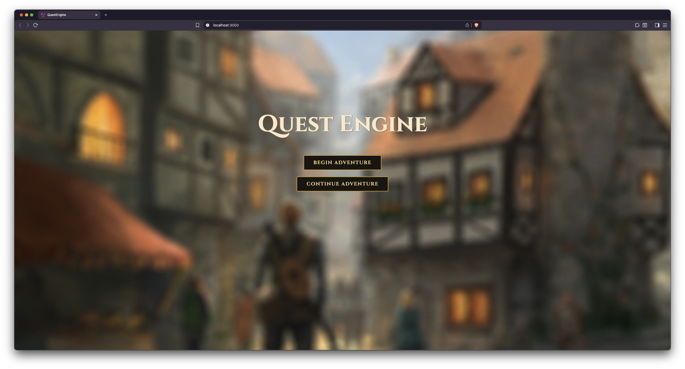
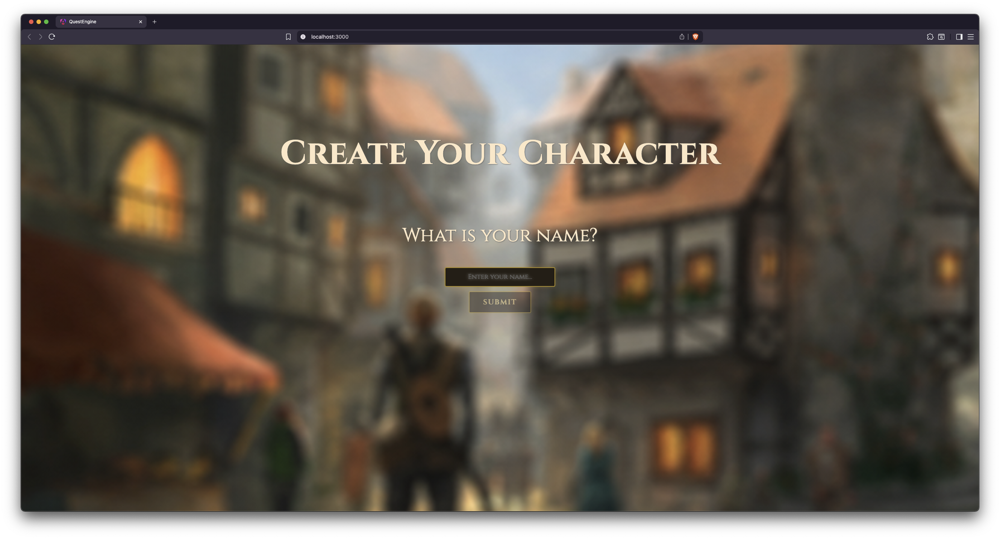
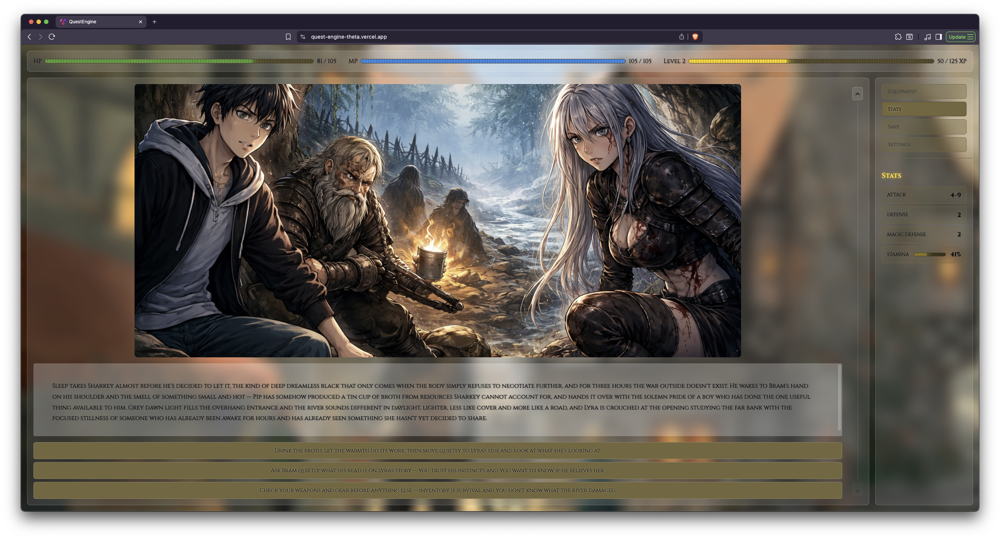
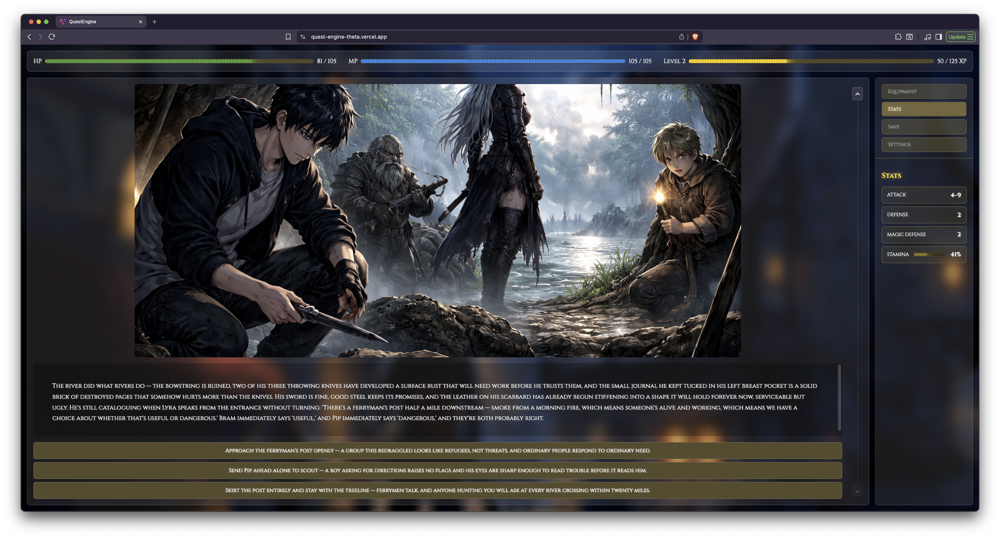
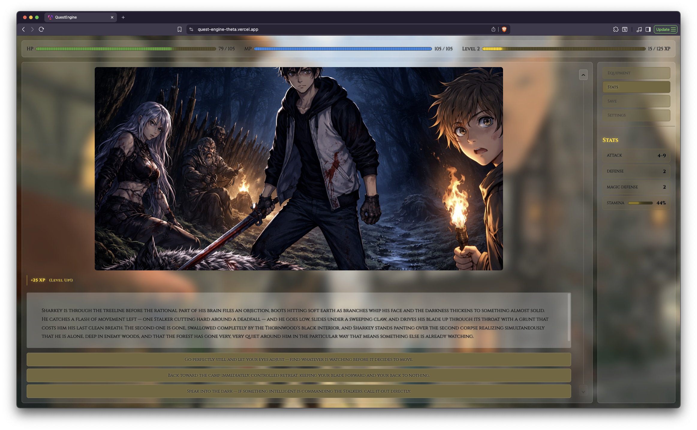
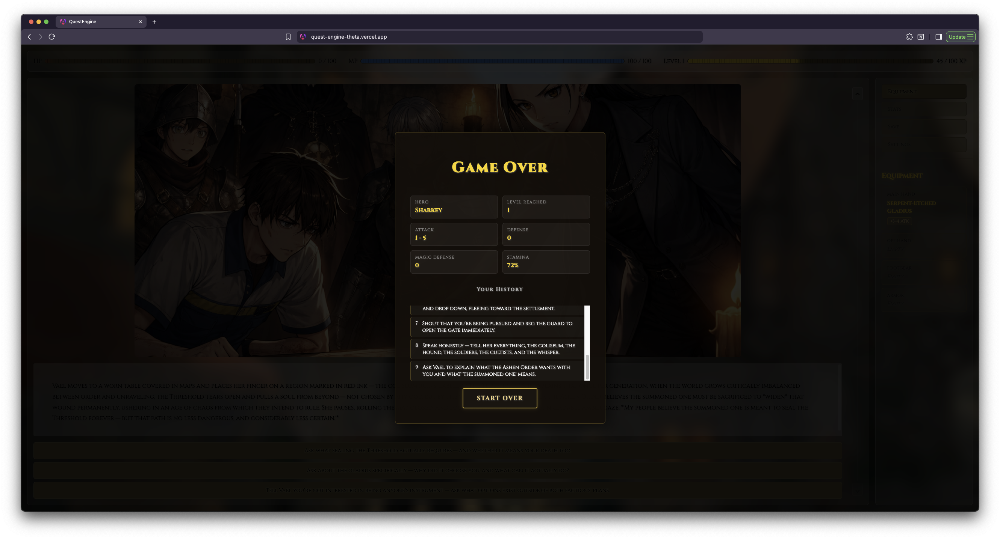
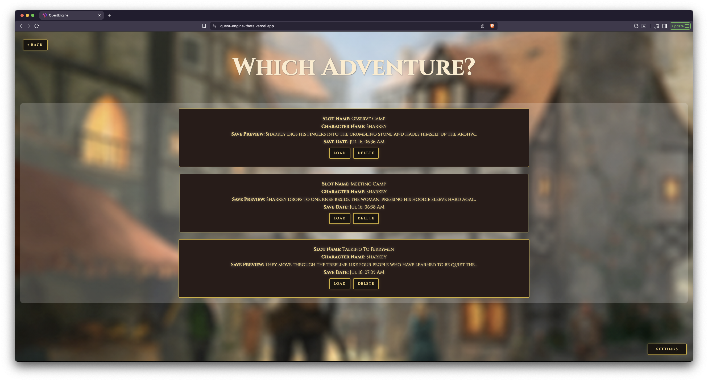

# QuestEngine

This project uses [Angular 22.0.4](https://github.com/angular/angular-cli), [Claude Sonnet 4.6](https://www-cdn.anthropic.com/bbd8ef16d70b7a1665f14f306ee88b53f686aa75/Claude%20Sonnet%204.6%20System%20Card.pdf) for story generation, [OpenAI Image Generation 2.0](https://developers.openai.com/api/docs/models/gpt-image-2) for image generation, and [Capacitor 8.5.0](https://capacitorjs.com/solution/angular) for iOS build.

Hosted on [Vercel](https://vercel.com/home)

Used modified image from Jereme Peabody. Please find his work on [DevianArt](https://www.deviantart.com/jjpeabody)

## Table of Contents
- [About](#about)
- [How to Install](#how-to-install)
- [How to Play](#how-to-play)
- [Tech Stack](#tech-stack)
- [Modify It For Yourself](#modify-it-for-yourself)
- [Images](#images)


## About
Quest Engine is a text-based RPG where every playthrough is different. The story is generated by Claude, which takes the user decisions and adapts the story to them. Decisions perisist and may affect available options later in the game. Each scene is accompanied by an AI-generated image that maintains visual consistency across the entire adventure.

Features:
- AI-generated branching narrative with real consequences
- AI-generated images with visually consistent character appearances
- Rolodex-style history to scroll back and see past decisions
- 3 save slots persisted to device storage
- Weapon and character stat tracking
- Game over screen with a journey summary
- Light and dark modes


## How to Install
### Desktop Version
#### 1. Install dependencies

```bash
npm install
```

#### 2. Run the dev server

```bash
ng serve
```

Open `http://localhost:4200` in your browser

#### 3. Add your API keys

Once the app is running, start a game, enter a name, and go to **Settings** in the side panel:
Provide your Claude and OpenAI keys and hit save for each.

- **Claude API Key** — from [console.anthropic.com](https://console.anthropic.com)
- **OpenAI API Key** — from [platform.openai.com](https://platform.openai.com) (optional — story works without it, images will show a placeholder)

Keys are saved to localStorage and persist between sessions, but if you clear your browser cache, you will lose them and whatever stories you have saved.

### iOS Version
#### 1. Install dependencies
```bash
npm install
```

#### 2. Build and sync the app
```bash
ng build
npx cap sync ios
```

#### 3. Open Xcode and run the simulator
_Note that to reflect changes to in the source code, you need to rebuild and sync the application._

## How to Play

If you don't want to host it yourself, you can also play at the following link: [QuestEngine](https://quest-engine-theta.vercel.app/)

Please note that you will still need your own API keys to play. refer to [Add your API keys](#3-add-your-api-keys)


## Tech Stack

- **Angular 22** — standalone components, signals, computed, effects, HostListener
- **TypeScript 5** — strict typing throughout
- **Claude Sonnet 4.6** — story generation via the Anthropic API
- **Open AI Image Generation 2.0** — scene image generation via the OpenAI API
- **Device Storage** — save slots and API key persistence
- **CSS** — webpage styling
- **ViTest** — unit testing
- **Capacitor 8** - native iOS wrapper
  - **capacitor-secure-storage-plugin** — stores API keys in the iOS Keychain


## Modify It For Yourself
Want to change it to fit your requirements? You can do it at these locations below

**Change the story prompt** — edit `systemPrompt` in `src/app/services/story.ts` to change the agents personality or story style. Do NOT change the JSON response format.

**Change the opening scene** — edit `firstMessage` in `startStory()` in `story.ts` to change the opening scene. I chose an anime-isekai start, but you can choose what you want.

**Change the image style** — edit `fullPrompt` in `generateImage()` in `story.ts` to change the genre of image or the Open AI image generation model. Please note that if you change the model, the body and acceptable image dimensions may need to chaneg as well.

## Images
<table align="center" border="0">
    <tr>
        <td align="center">
            <br> 
            <sub>Starting Screen</sub>
        </td>
        <td align="center">
            <br>
            <sub>Character Creation</sub>
        </td>
    </tr>
    <tr>
        <td align="center">
            <br> 
            <sub>Gameplay</sub>
        </td>
        <td align="center">
            <br> 
            <sub>Dark-Mode Gameplay</sub>
        </td>
    </tr>
    <tr>
        <td align="center">
            <br> 
            <sub>Stats Section</sub>
        </td>
        <td align="center">
            <br> 
            <sub>Game Over</sub>
        </td>
    </tr>
    <tr>
        <td align="center">
            <br> 
            <sub>Save Slots</sub>
        </td>
    </tr>
</table>
